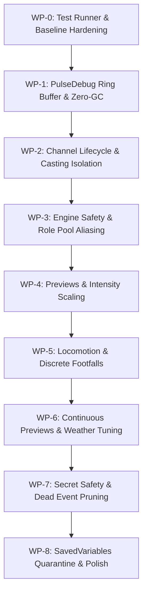

# Implementation Plan: PulseSensation Comprehensive Code Review Fixes

**Target Client:** World of Warcraft `_classic_beta_` ("WoW Forever", 12.0/Midnight engine)  
**Baseline Commit:** `955c066` (local HEAD on `main`, unpushed)  
**Scope:** 31 findings (`CR-001` through `CR-031`) verified across Core, Modules, UI, PulseDebug, PulseChecklist, and test runners.

---

## 1. Executive Summary & Verification Ledger

All findings from the incoming review documents (`CODE_REVIEW.md`, `DOCS_COMPILATION.md`, `HANDOFF_GEMINI_FIXES.md`, `LOCOMOTION_REPORT.md`, and `Ongoing Bugs/*.rtf, *.md`) have been cross-checked directly against the active codebase. 

### Findings Summary by Priority

| Severity | Count | IDs | Verification Summary |
|---|---|---|---|
| **P1** (Critical Feel & Signal Loss) | 6 | `CR-001`, `CR-002`, `CR-004`, `CR-005`, `CR-008`, `CR-013` | **All 6 Verified.** Channel start/succeeded disconnect, cross-talk cast cancellation, flat continuous preview, locomotion cadence doubling & continuous floor blur, intensity scaling non-linearities, and role-pool ring buffer aliasing under concurrent timers. |
| **P2** (Functional Defects & API Safety) | 14 | `CR-003`, `CR-006`, `CR-007`, `CR-009`, `CR-010`, `CR-011`, `CR-012`, `CR-014`, `CR-015`, `CR-016`, `CR-017`, `CR-019`, `CR-026`, `CR-029` | **All 14 Verified.** Includes strength 0 floor hum (`CR-029`), PulseDebug OnUpdate GC explosion (`CR-016`), secret value crashes in combat/chat, dead `C_EncounterEvents` APIs, and craft strike intensity bypass. |
| **P3** (Polish, Taint & Documentation Drift) | 11 | `CR-018`, `CR-020`, `CR-021`, `CR-022`, `CR-023`, `CR-024`, `CR-025`, `CR-027`, `CR-028`, `CR-030`, `CR-031` | **All 11 Verified.** Includes Xbox default schema split-footfall bug (`CR-030`), registration-restricted ping event (`CR-031`), test runner `set -e` crash masking, and SavedVariables validation. |

---

## 2. Key Decisions Required from User (D1 to D9)

The following 9 architectural/feel decisions belong to the user. Default recommendations are provided to keep work unblocked:

| ID | Decision | Affected Finding | Options | Recommendation |
|---|---|---|---|---|
| **D1** | **Retain Commit `955c066`** | WP-0 Baseline | (A) Keep existing fixes for Hearthstone 30s, PlayMode step floor, Rename notify, and Watchdog onset.<br>(B) Reset and re-apply. | **Option A (Keep):** Clean local commit already passes all 7 suites and 53-file luacheck. |
| **D2** | **Mixer Policy** | `CR-008 d` | (A) Keep saturating sum ($1 - (1-a)(1-b)$) for continuous layers.<br>(B) Add toggle in Settings back to legacy MAX blend. | **Option A:** Immersion-first continuous mixing is authored deliberately. |
| **D3** | **Cue Intensity Law** | `CR-008 a` | (A) Multiply intensity post-shaping.<br>(B) Cap slider at mode's relative ceiling. | **Option A:** Preserves authored intra-mode dynamics while scaling amplitude. |
| **D4** | **Breakaway Floor Shaping** | `CR-008 b`, `CR-005` | (A) Keep linear lift `floor + (1-floor)*x`.<br>(B) Switch to dead-zone curve `(x - floor)/(1 - floor)` or quadratic knee. | **Option B (Selective):** Implement dead-zone curve for discrete taps & locomotion to eliminate permanent floor blocks. |
| **D5** | **Overall Intensity Scope** | `CR-008 c` | (A) Keep global master intensity.<br>(B) Make master intensity per-profile. | **Option A:** Keep global for hardware calibration simplicity. |
| **D6** | **Boss Ability Warnings** | `CR-007` | (A) Hide `bossAbilityWarning` cue on Forever client.<br>(B) Attempt migration to `C_EncounterTimeline`. | **Option A (Hide/Caveat):** Forever lacks `C_EncounterEvents`; fallback to `bossChatWarning`. |
| **D7** | **Ping Placed Cue** | `CR-031` | (A) Hide / disable `pingPinAdded` on Forever.<br>(B) Strip restricted event and keep as no-op. | **Option A:** Remove registration to prevent FrameXML blocked action messages. |
| **D8** | **Feel & Tuning Defaults** | `CR-003`, `CR-005`, `CR-009`, `CR-026` | (A) Adopt measured defaults: fishing 0.05, weather 0.15, controller UI default OFF for mouse.<br>(B) Keep current stock defaults. | **Option A:** Significantly improves out-of-the-box tactile balance. |
| **D9** | **Cadence Unit Migration** | `CR-005 (4)` | (A) Migrate saved cadence values (halve numbers) on `DB_VERSION` bump.<br>(B) Keep raw numbers. | **Option A:** Keeps player footfall rate intact when converting cycle frequency to steps/sec. |

---

## 3. Sequenced Work Packages



---

### WP-0: Baseline & Test Runner Hardening
*Objective: Ensure infallible regression detection before introducing further fixes.*

1. **Test Runner Robustness (`scripts/test.sh` - `CR-027`):**
   - Use `LUA="${LUA:-luajit}"` with fallback to `lua`.
   - Capture command substitution exit status safely (`|| status=$?`) so crashes never exit silently.
   - Use here-strings (`<<< "$TEST_OUT"`) instead of pipe grep.
2. **Sweep Constant Cleanup (`PulseHaptics/Core/CastActivity.lua`):**
   - Replace literal magic number `60` with `HARD_SWEEP_CEILING = 60`.
   - Update engine comments to reflect exact `forceSend = isOnset` behavior.
3. **Fix Vacuous Assertions (`PulseChecklist/tests/` - `CR-017`):**
   - In `crafting-test.lua`, verify active player cast removal past 60s while `UnitCastingInfo` is sustained.
   - Align `pulsedebug-test.lua` mock with actual `Pulse.Engine` API (remove fake `HoldLayer`/`CancelAll`).

*Deliverable:* `./scripts/test.sh` runs cleanly under both `lua` and `luajit`, and exits non-zero if any test fails.

---

### WP-1: PulseDebug Optimization & In-Game Diagnostics
*Objective: Eliminate garbage collection in diagnostic tools and give the player a reliable cast trace.*

1. **Debounce Continuous HOLD Logging (`PulseDebug/UI.lua` - `CR-016`):**
   - Log `HOLD` events on rising edge only (transition from idle or magnitude change > 0.05), matching `HOLD_LOG_GAP` in `Core/Init.lua`.
   - Replace `table.insert(eventLog, 1, entry)` with a pre-allocated fixed circular ring buffer to prevent per-frame array re-indexing and allocations.
   - Install hooks only when the debug window is shown (`OnShow`), unhook or silence when hidden.
2. **Add Cast Trace Diagnostic:**
   - Add a lightweight event trace view in PulseDebug showing incoming `CastActivity` classifications, `castGUID`, `spellID`, and timestamps to help the user diagnose spell batching in-game.

*Deliverable:* Running `/pdebug` with continuous textures active generates zero table allocations per frame.

---

### WP-2: Channel Lifecycle & Casting Cross-Talk Isolation
*Objective: Fix channeling and fishing haptics so channels hum smoothly until completion.*

1. **Cast Identity Tracking (`PulseHaptics/Modules/Combat.lua` - `CR-002`):**
   - Store the specific `castGUID` and `spellID` that initiated `castTexture`.
   - When receiving `FAILED`, `INTERRUPTED`, `INSTANT`, or `CAST_STOPPED`, verify the event matches the active cast's identity before cancelling `castFrame:SetScript("OnUpdate", nil)`.
   - Prevents spam-clicks of other spells or off-GCD instant abilities from prematurely killing an ongoing channel/cast.
2. **Channel Completion Semantics (`PulseHaptics/Core/CastActivity.lua` - `CR-001`):**
   - On modern 12.x engines, `UNIT_SPELLCAST_SUCCEEDED` fires at the *start* of a channeled spell. Treat this as channel confirmation, NOT completion.
   - Emit `CHANNEL_COMPLETE` exclusively upon `UNIT_SPELLCAST_CHANNEL_STOP` when not interrupted (`interruptedBy == nil`).
3. **Crafting & Fishing Channel Teardown (`PulseHaptics/Modules/Crafting.lua` - `CR-001`, `CR-003`):**
   - End fishing/crafting textures only when the tracked fishing `spellID` terminates.
   - Adjust baseline fishing bed intensity to an audible 0.05 (post-master) so it is tactile on gamepads.

*Deliverable:* Dedicated tests in `crafting-test.lua` proving channels survive unrelated instant casts and spam-failed presses.

---

### WP-3: Engine Safety & Role Pool Aliasing
*Objective: Guarantee discrete mode step integrity and hardware error isolation.*

1. **Eliminate Ring Pool Aliasing (`PulseHaptics/Core/Engine.lua` - `CR-013`):**
   - Apply `eng-01-fix-draft.md`: use `getRoleTable()` only for immediate synchronous steps (`at <= 0`).
   - For delayed steps, capture scalar magnitudes (`low`, `high`, `ltrigger`, `rtrigger`) as local variables in the timer closure. Build the roles table upon timer execution, preventing pool wrap-around corruption.
2. **Zero Gain Silence Enforcement (`PulseHaptics/Core/Engine.lua` - `CR-029`):**
   - In `driveChannel`, apply gain before the zero check:
     ```lua
     wanted = clamp01((wanted or 0) * channelConfig(channel, "gain"))
     if wanted <= 0 then
         wanted = 0
     else
         -- apply gamma and floor lift
     end
     ```
   - Guarantees setting Strength to 0% completely silences the motor instead of holding at the breakaway floor.
3. **Transient Path for Hold-Based Knocks (`CR-012`):**
   - Add `isTransient` support to `Engine:Hold` and `Pulse:HoldIfEnabled` so short cues (heartbeat knocks, breath gasps) utilize fast 12ms `transientAttackTau` rather than 75ms continuous smoothing.
4. **Wrap Raw Calibration Calls in `pcall` (`Engine.lua:518, 529` - `ENG-03`):**
   - Protect raw `C_GamePad.SetVibration` calls and handle errors locally without triggering engine-wide `StopAll()`.
5. **Documentation Alignment (`Engine.lua` - `CR-025`):**
   - Update header comments from "max-blend" to describe the saturating sum continuous mixer and role-to-channel routing.

*Deliverable:* Regression tests verifying 16+ concurrent steps do not corrupt delayed pulse strengths, and gain 0 yields zero output.

---

### WP-4: Preview Scaling & Intensity Fidelity
*Objective: Ensure preview buttons and dropdowns respect user-configured intensity sliders.*

1. **Heartbeat Previews (`PulseHaptics/Modules/Health.lua` - `CR-006`):**
   - Pass configured cue intensity into `TestHeartbeat` and `TestWarningBeat`.
2. **Crafting Strike Intensity (`PulseHaptics/Modules/Crafting.lua` - `CR-014`):**
   - Multiply anvil strike strength by `Pulse.Database:GetTriggerSetting(CUE, "intensity", 1.0)`.
3. **Dropdown Mode Selection Preview (`PulseHaptics/UI/Panel/Popup.lua` - `CR-018`):**
   - Preview selected modes using the active cue's configured intensity rather than raw 1.0.
4. **Intensity Law Calibration (`CR-008 a–c` per D3–D5):**
   - Ensure slider curves scale predictably across all preset floors.

*Deliverable:* Previews in UI match in-game cue strength across all intensity settings.

---

### WP-5: Locomotion & Footfall Physics
*Objective: Transform muddy locomotion rumble into crisp, distinct footfalls.*

1. **Discrete Footfalls (`PulseHaptics/Modules/Locomotion.lua` - `CR-005`):**
   - Re-architect footfalls from continuous sine wave holds into short discrete transient taps (35–50ms) scheduled at step points.
   - Correct cadence to represent real steps per second (removing the 2× frequency doubling).
   - In `GALLOP`, structure timing as authentic 3-beat/4-beat stride patterns rather than 11Hz sine buzzes.
2. **Schema-Aware Footfall Splitting (`PulseHaptics/Modules/Locomotion.lua` - `CR-030`):**
   - In `shouldSplitFeet()`, check not only `preset.triggers`, but verify that the active schema actually maps `ltrigger` and `rtrigger` to independent trigger channels (`resolveRole(schema, "ltrigger").channel ~= "Low"`).
   - Under `Standard` schema, keeps footfalls unified on Low rather than routing right feet to High.
3. **Applied Preset Tracking (`PulseHaptics/Core/Database.lua` - `CR-020`):**
   - Store `appliedDevicePreset` upon clicking Apply, and inspect that rather than the pending dropdown selection.

*Deliverable:* `locomotion-test.lua` verifies footfall counts per second match the configured cadence.

---

### WP-6: Continuous Previews & Weather Tuning
*Objective: Replace flat 0.45 rumble with authored module previews.*

1. **Module-Driven Continuous Previews (`PulseHaptics/Core/Init.lua` - `CR-004`):**
   - Implement `Preview(duration, scale)` hooks in continuous modules (`Movement`, `Flight`, `Environment`, `Crafting`, `Combat`).
   - `Pulse:TestCue` invokes the module's preview function with synthetic state, producing authentic textures instead of flat 0.45 rumble.
2. **Weather Texture Tunability (`PulseHaptics/Modules/Environment.lua` - `CR-026`):**
   - Expose sensitivity and base intensity tunables for weather haptics, raising default level to tactile range.

*Deliverable:* Clicking Preview on continuous cues showcases real module dynamics.

---

### WP-7: Secret Safety & Dead Event Pruning
*Objective: Bulletproof the addon against restricted execution contexts and secret values on modern 12.x.*

1. **Controller UI Input Detection (`PulseHaptics/Modules/ControllerUI.lua` - `CR-009`):**
   - Trust `InputUtil.IsGamepadUIEnabled()` when present; only execute fallbacks if the API is nil.
2. **Secret Value Guards (`AlertUnitWatch.lua`, `World.lua`, `CastActivity.lua` - `CR-010`, `CR-011`):**
   - Remove redundant `unit ~= "target"` check in `AlertUnitWatch.lua` (already filtered by `RegisterUnitEvent`).
   - In `World.lua`, check `issecretvalue(message)` and `issecretvalue(sender)` before string matching. Escape magic characters in `playerName` and handle non-ASCII names.
   - In `CastActivity:keyFor`, guard against secret `castGUID` and `spellID`.
3. **Dead Event & Forbidden Registration Pruning (`CR-007`, `CR-031`, `CR-024`):**
   - Unregister or hide `pingPinAdded` (`UNIT_PING_PIN_ADDED` is restricted on Forever).
   - Remove dead event `LEARNED_SPELL_IN_TAB` and `PING_PIN_ADDED`.
   - Add `PulseDebugFrame` and `PulseChecklistFrame` to `UISpecialFrames`.
4. **Checklist Import Parsing (`PulseChecklist/Checklist.lua` - `CR-015`):**
   - Match status keywords (`needs work`, `failed`, `functioning`) only on lines beginning with markdown headers (`^#+`).

*Deliverable:* Zero secret value errors and zero FrameXML blocked action warnings during combat and chat events.

---

### WP-8: Polish, Typo Sweep & Type Quarantine
*Objective: Eliminate state desyncs, validate database loading, and clean up documentation.*

1. **Database `lastResolved` Cleanup (`PulseHaptics/Core/Database.lua` - `CR-021`):**
   - Update `lastResolved` immediately upon profile rename and deletion to eliminate redundant re-syncs.
2. **SavedVariables Type Quarantine (`PulseHaptics/Core/Database.lua` - `CR-022`):**
   - Validate table structures during `Database:Init()`, resetting malformed entries to prevent initialization crashes.
3. **Combat-Safe Keyboard Handling (`PulseHaptics/UI/Panel/Popup.lua` - `CR-023`):**
   - Skip `SetPropagateKeyboardInput` when `InCombatLockdown()` is true.
4. **Documentation & Text Alignment (`CR-025`, `CR-019` extension):**
   - Correct Ramp calibration tooltip text from "half power over eight seconds" to actual ~16s timing.
   - Reorder `NAME_PATTERNS` in `Devices.lua` to prioritize `"8bitdo"` and `"sn30"` over generic `"xinput"`.
   - Update README cue counts (190 cues across 16 active categories).

*Deliverable:* Clean luacheck across 100% of files, all docs aligned with runtime reality.

---

## 4. Verification & Testing Strategy

Each work package will be verified before moving to the next:
1. **Automated Unit Tests:** Every fix must be accompanied by a dedicated offline unit test in `PulseChecklist/tests/`.
2. **Static Analysis:** `luacheck` must report 0 warnings and 0 errors across all 53 files.
3. **Lua Dialect Compliance:** Tests must pass under both standard `lua` and embedded `luajit` (Rule 2).
4. **Zero-GC & Taint Discipline:** No table allocations in `OnUpdate` or `OnEvent` hot paths (Rule 4), no unprotected modifications to Blizzard structures (Rule 5).
5. **Git Policy:** Atomic local commits following `fix(<area>): <what> (CR-0xx)`. **No pushes to remote.**
